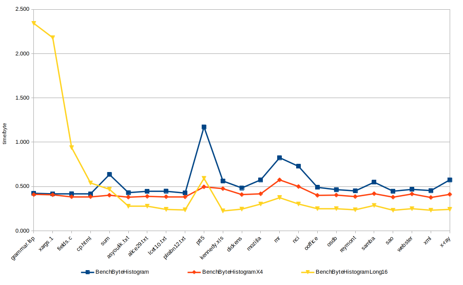

# fast-histogram

Fast byte histogram

## Random benchmark results

```
Intel(R) Core(TM) i7-8565U CPU
---------------------------------------------------------------------------
Benchmark                                 Time             CPU   Iterations
---------------------------------------------------------------------------
BenchByteHistogram/8                   10.2 ns         10.1 ns     68690175
BenchByteHistogram/64                  29.7 ns         29.7 ns     23657317
BenchByteHistogram/512                  216 ns          216 ns      3242727
BenchByteHistogram/4096                1712 ns         1709 ns       409052
BenchByteHistogram/32768              13663 ns        13641 ns        50530
BenchByteHistogram/262144            109077 ns       108892 ns         6336
BenchByteHistogram/1048576           434907 ns       434135 ns         1600
BenchByteHistogramX4/8                 55.5 ns         55.4 ns     12319216
BenchByteHistogramX4/64                73.7 ns         73.6 ns      9417606
BenchByteHistogramX4/512                235 ns          234 ns      2991075
BenchByteHistogramX4/4096              1533 ns         1531 ns       455040
BenchByteHistogramX4/32768            11720 ns        11702 ns        59421
BenchByteHistogramX4/262144           92725 ns        92562 ns         7460
BenchByteHistogramX4/1048576         370919 ns       370262 ns         1883
BenchByteHistogramX256/8               6803 ns         6793 ns        98161
BenchByteHistogramX256/64              6834 ns         6822 ns        96928
BenchByteHistogramX256/512             7114 ns         7102 ns        92994
BenchByteHistogramX256/4096            8691 ns         8676 ns        76535
BenchByteHistogramX256/32768          20304 ns        20270 ns        34312
BenchByteHistogramX256/262144        114545 ns       114326 ns         6044
BenchByteHistogramX256/1048576       432834 ns       432031 ns         1628
BenchByteHistogramLong16/8             8758 ns         8744 ns        78074
BenchByteHistogramLong16/64            8835 ns         8820 ns        77006
BenchByteHistogramLong16/512           8946 ns         8930 ns        76350
BenchByteHistogramLong16/4096          9595 ns         9580 ns        73043
BenchByteHistogramLong16/32768        15073 ns        15049 ns        46182
BenchByteHistogramLong16/262144       65295 ns        65181 ns        10288
BenchByteHistogramLong16/1048576     235049 ns       234631 ns         2961
```

## Standard inputs


